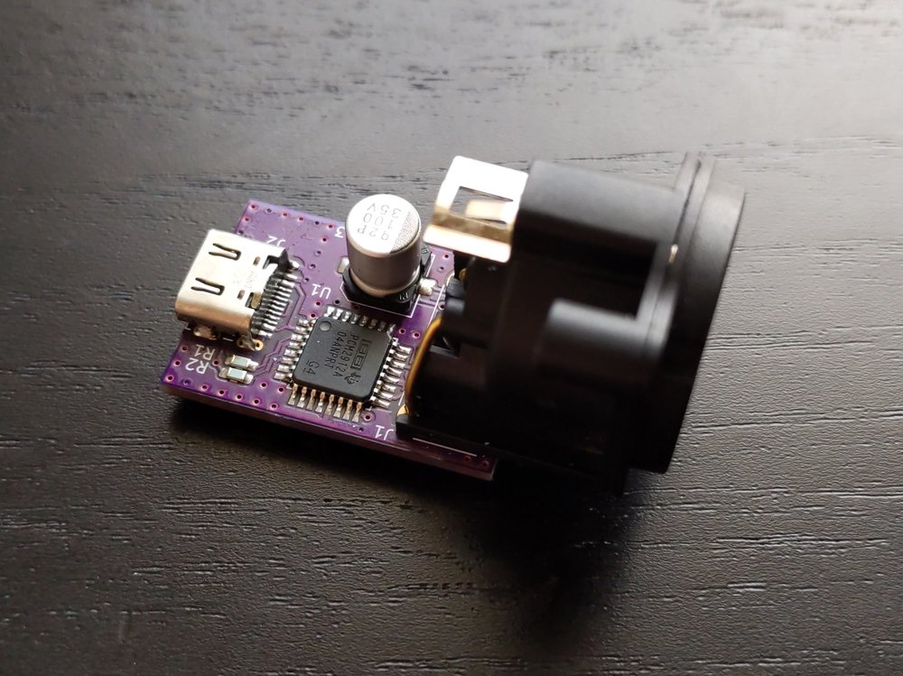
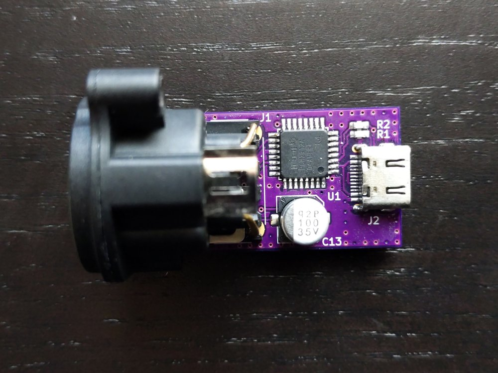
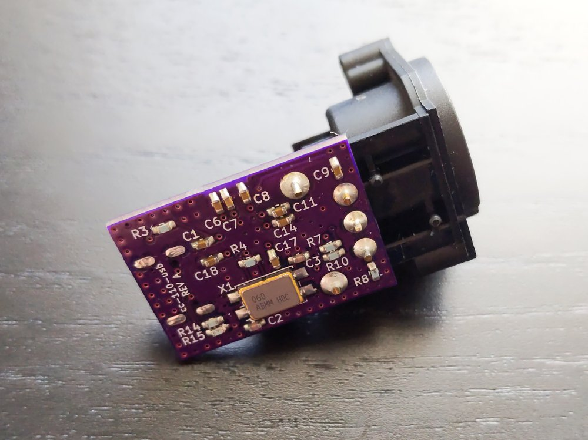
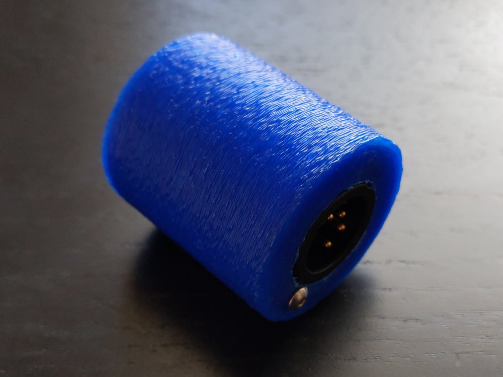
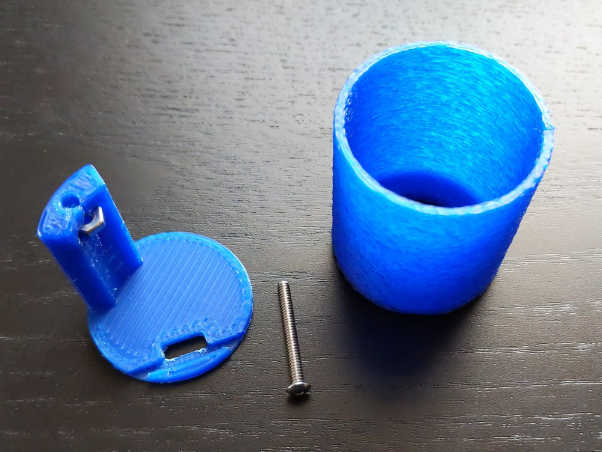
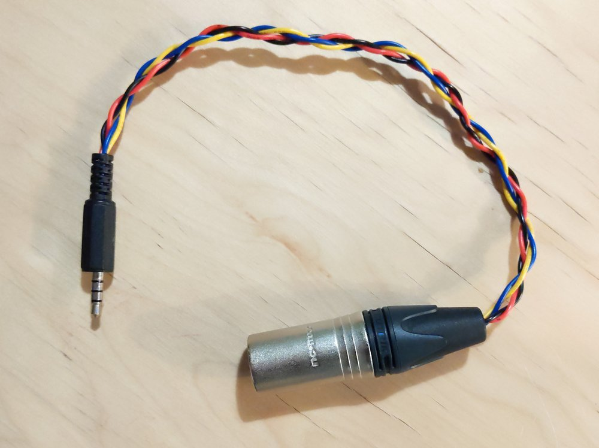

# cc-110-usb

The cc-110-usb converter allows you to connect a ClearCom [CC-110](https://www.clearcom.com/product/cc-110/) single-ear headset to a computer or smartphone via class-compliant USB audio.

 <b>cc-110-usb without enclosure</b>

# build

Build a cc-110-usb using the included design files:
* Order a set of 3 PCBs from [OSHPark](https://oshpark.com/shared_projects/4OjzXrBn) or send the [gerbers](build/cc-110-usb_gerber.zip) to your preferred supplier. This project involves surface mount soldering in a small space. Review the PCB layout before proceeding.
* Import the [BOM](build/cc-110-usb_bom.csv) directly into Mouser, parse it with your favorite BOM tool, or order parts individually.
* Assemble the PCB according to the [schematic](build/cc-110-usb_schematic.pdf).
* Print the enclosure from the [STLs](enclosure/) or order from a 3D-printing service. You will also need suitable hardware and tools, described in the enclosure section.

Estimated cost for one unit at the time of writing is less than 25 USD, excluding tax, shipping, and consumables.

# narrative

As I needed to carry a CC-110 headset for work, I started this project so that I could also use it with my computer. The CC-110 has significantly better noise rejection than my laptop microphone and helps when speaking in a loud environment. I do not recommend buying a CC-110 just to use with this converter, since there are many headsets that will work without a converter or offer better quality with less effort.

At the time of writing, I have used the cc-110-usb for about a year with excellent results. I have no way to quantify the performance, but I can report a meaningful reduction in background noise compared to my laptop microphone and positive comments from peers about sound quality.

# electrical design

## cc-110 specifications

The CC-110 has the following relevant electrical specifications, which have been extracted from its product page. All values are typical and measured at 1 kHz.
* **Speaker Impedance** 400 ±30% Ohms
* **Microphone Impedance** 200 ±30% Ohms
* **Open Circuit Sensitivity** -64 ±3.5 dB V at 99 dB ±3 dB SPL
* **Connector** 4-Pin XLR, Female (XLR4F), with pinout below

 

XLR4F Pin | Function
------ | ----
1 | `MIC -`
2 | `MIC +`
3 | `SPK -`
4 | `SPK +`

 

A typical conversation causes approximately [60 dB SPL](https://www.cdc.gov/nceh/hearing_loss/what_noises_cause_hearing_loss.html). Assuming a 2 m distance, 1 cm microphone placement, and that sound pressure decreases at *1/r*, a typical human might output 106 db SPL at the microphone, which calculates to **4 mVpp** at the microphone connector.

No sensitivity is given for the headphone. The compatible ClearCom [HMS-4X](https://www.clearcom.com/product/hms-4x/) provides up to 3.1 V (+12 dB uV) output. The minimum headphone impedance of 32 Ohms suggests an internal resistance of approximately the same. Therefore, the power delivered to the headphones is around **20 mW**. At a [representative sensitivity](https://service.shure.com/s/article/understanding-earphone-headphone-specifications?language=en_US) of 100 dB SPL / mW, the headphone would produce 113 dB SPL. This is a loud but believable output, considering the HMS-4X can drive multiple headsets in parallel and that the system is designed to work in noisy environments.

There are a lot of assumptions here, but the results should reasonably inform the requirements for amplifier, ADC, and DAC performance.

## audio codec

The Texas Instruments [PCM2912A](https://www.ti.com/lit/ds/symlink/pcm2912a.pdf) (PDF) is a USB class-class compliant audio codec with integrated stereo DAC and mono ADC. It is well suited to this application.

The PCM2912A provides a 20 kOhm microphone preamplifier with fixed 20 dB gain followed by up to 30 dB of USB-programmable gain. The PCM2912A ADC accepts **1.4 Vpp** before clipping. The estimated input voltage of 4 mVpp after 50dB of gain is **1.3 Vpp** and should therefore be a reasonable match for the ADC.

The PCM2912A provides a maximum per-channel speaker output of 1.3 V, yielding 13 mW into a 32 Ohm load from a calculated 32 Ohm internal resistance. Connecting the CC-110 400 Ohm load and summing the left and right channels through a comparably low value mixing resistor results in about **14 mW** delivered to the headset. This is less than the estimated HMS-4X maximum output but still sufficient to produce 110 dB SPL from the representative earpiece. The actual output volume will also depend on the level of the media source and the USB-programmable attenuation.

# pcb design

## components
Components were selected, in priority order,
1. To meet the requirements of the circuit;
1. To be possible to hand solder with an iron;
1. To source from a single supplier (at the time of design); and
1. To minimize cost.

USB C allows the converter to easily connect to both laptops and smartphones. It is easily adapted to USB A externally if required.

 <b>CC-110 PCB top</b>

## layout
Layout is primarily optimized for size, with locations assigned based on trace length sensitivity.

Decoupling capacitors are placed beneath the PCM2912A IC; the microphone input trace is short and separated from other traces. To the extent possible, analog signals and digital signals are separated on opposite sides of the board, though they share the same ground plane.

 <b>CC-110 PCB bottom</b>

Other common layout best practices have a negligible impact due to the small PCB size and are therefore deprioritized. For example, the crystal and IC are located on opposite sides of the board, but the absolute length is still small enough to prevent the need to specifically tune the load capacitors. Similarly, the USB traces leave the connector from both sides, rather than in parallel, but the short distance mitigates signal loss or noise issues.

# mechanical design

 <b>cc-110-usb in enclosure</b>

A basic 3D-printed cylindrical enclosure contains the cc-110-usb PCB assembly. The mechanical design is primarily functional, with no specific assessment of durability or stress.

The enclosure is constructed of two parts. A single machine screw restrains the XLR4-side enclosure, the XLR4 connector itself, and the USB-side enclosure. The USB-side enclosure has a standoff that captures a retaining nut and a slot to hold the PCB.

 <b>cc-110-usb enclosure disassembled</b>

The pictured assembly uses a McMaster [92949A116](https://www.mcmaster.com/92949A116/) machine screw and [91841A005](https://www.mcmaster.com/91841A005/) nut. This \#4-40 screw is slightly too large for the XLR4 connector's opening, and a small file was used to increase the diameter of the XLR4. A smaller screw may avoid this problem.

Similarly, depending on the quality of 3D print, the USB-side enclosure may need some filing for the PCB to sit flush in the slot.

# history

Before designing the USB converter, I first attempted a direct connection from the XLR4 to my laptop's TRRS headset jack.

 <b>passive XLR4 to TRRS adapter</b>

While this worked with my phone, it did not work with my laptop. Further research then suggested that a passive converter is not the right approach because performance would vary across devices.
* Each device has unique gain capabilities and microphone impedance requirements, which can affect the ability to cleanly amplify a signal from the CC-110.
* Many devices sense the resistance between `MIC +` and `GND` to detect the presence of a microphone or the activation of an in-line control. The impedance levels are [well-understood](https://source.android.com/devices/accessories/headset/plug-headset-spec) but possibly incompatible with the CC-110's 200 Ohms, depending on the individual implementation. An impedance transformer or terminator would be required for compatibility, further complicating the gain considerations above.
* Some devices apply as bias voltage to detect the presence of in-line controls or to power an electret-style microphone. Bias is not necessary for the CC-110's dynamic microphone and may cause damage.

# changelog

## breadboard
The breadboard implementation performs well, and validates the assumptions enough to proceed to a PCB design. Some noise is audible, but it seems to be related to poor grounding. A proper ground plane on the PCB should reduce the noise. Microphone levels are acceptable at gains between 50% and 100%, depending on speaking volume and microphone placement. Speaker output is loud enough within the range of 20% to 50%, depending on source level.

## REV A
Noise improved as expected and is no longer an issue. Overall performance matched expectations.

# license
The cc-110-usb is licensed under [CC BY-NC-SA 4.0](https://creativecommons.org/licenses/by-nc-sa/4.0/).
